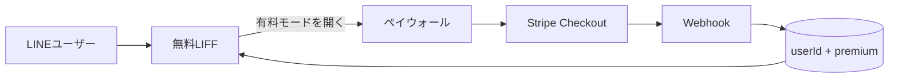

# ロードマップ：フリーミアム（無料 LIFF ＋ Web 決済の有料解放）

対象: `/Users/sen/Development/guitar-chord-quiz-line/`  
目的: **App Store なし**で収益化。LINE を入口、課金は Web（Stripe 等）。将来サブスク／講座／B2B にピボット可能にする。

更新日: 2026-09-08

---

## 0. 方針（ロック）

| 項目 | 内容 |
| :--- | :--- |
| 入口 | LINE LIFF（＋必要なら通常ブラウザも可） |
| 無料 | 練習：大譜表 ＋ 暗記：コード（ドレミ）＋ 暗記：大譜表 ＋ 初級：開放弦 ＋ 練習：開放弦 |
| 有料 | それ以外の全モード（ダイアグラム／TAB／ダイアトニック／カノン等） |
| 価格（初回仮説） | **買い切り**（例: ¥480〜¥980）。月額は Phase 後段 |
| 決済 | **Stripe Checkout**（LIFF 外 or 同一オリジンの決済ページ） |
| 権利判定 | LINE `userId`（またはブラウザ用匿名 ID）をサーバーに保存し `isPremium` |
| ピボット余地 | 機能解放フラグを「商品SKU」にすれば、講座バンドル・教室ライセンスに流用可 |



---

## 1. 無料／有料の切り分け（v1）

### 無料

- 練習：大譜表
- 暗記：コード（ドレミ）
- 暗記：大譜表（E2〜E5）
- 初級：開放弦
- 練習：開放弦

### 有料（Premium）

- 暗記：ダイアグラム（全セット）
- 暗記：TAB（全セット・構成音含む）
- ダイアトニック（C）／練習
- カノン進行（C）（D）
- （将来追加モードは原則有料）

ペイウォール表示タイミング:

- 有料モードを選択したとき
- （任意）12連続クリア後のモード選択で有料モードを選んだとき

---

## 2. 技術構成（最小）

```text
guitar-chord-quiz-line/          # Vite フロント（GitHub Pages）
  + premium gate（モードロック）
backend/gcq-api/                 # ★本番 API（コスタバと同じサーバー）
  PHP + MySQL
  https://costuba.online/gcq-api/
backend/（任意）                  # ローカル用 Node / Cloudflare Workers 試作
```

本番ホスト:

- フロント: GitHub Pages（LIFF）
- API: **costuba.online/gcq-api/**（GMO レンタル・WordPress と同サーバー）
- DB: 同サーバー MySQL（専用 DB 推奨）
- 決済: Stripe Checkout + Webhook → `gcq-api/api/webhook.php`

将来のコスタバ本体課金も、同じ Stripe アカウント／同系 API をサイト配下に足せる。

LINE Login:

- 既存 LIFF の ID token を `liff.getIDToken()` で取得し API に送る
- サーバーで検証して userId を確定（クライアント申告 alone は不可）

---

## 3. フェーズ分け

### Phase 0 — 商品定義（0.5日）

- [x] 無料／有料表を確定（本ドキュメントの切り分けでよいか最終確認）
- [x] 価格・商品名（例: 「ギターコードクイズ Premium」）— 仮: ¥980 買い切り
- [ ] 特商法・プライバシー・音源ライセンスの掲載場所を決める

### Phase 1 — フロントのゲートのみ（課金モック）

- [x] `isPremium` をローカルフラグで擬似（開発用）
- [x] 有料モード選択時にペイウォール UI（「解放する」ボタン）
- [x] モード一覧で 🔒 表示

完了条件: 課金なしでも UX の流れが分かる。

### Phase 2 — バックエンド ＋ Stripe テストモード

- [x] DB に userId / premium（D1 / ローカルメモリ）
- [x] ID token 検証 API（`POST /api/me`）
- [x] Checkout Session（test key 想定・`POST /api/checkout`）
- [x] Webhook で premium 更新（`POST /api/webhook`）
- [x] LIFF 起動時に `/api/me` で状態取得（`VITE_API_BASE`）

完了条件: テストカードで買い切り → リロード後も有料モード解放。  
実装: **`backend/gcq-api/`（PHP・コスタバ配下）** が本番本線。設置手順は `backend/gcq-api/README.md`。  
（`backend/` の Node/Workers はローカル試作用に残置。）

### Phase 3 — 本番決済 ＋ 法務ページ

- [ ] Stripe live／Webhook 本番 endpoint
- [ ] プライバシーポリシー・特商法・利用規約（静的ページで可）
- [ ] ATTRIBUTION／商用音源の再確認
- [ ] 購入完了・失敗・復元（再ログイン）の文言

### Phase 4 — 公開オペレーション

- [ ] LINE 公式アカウントで導線（「練習はこちら」→ LIFF）
- [ ] 無料で価値を感じる初回体験（12連続 → 次モード誘導でペイウォール）
- [ ] 売上・購入数の簡易ダッシュボード（Stripe 管理画面で可）

### Phase 5 — ピボット用の仕込み（任意・後で）

- [ ] SKU を `premium_lifetime` / `premium_monthly` に分割可能に
- [ ] 「講座セット」用クーポン
- [ ] 教室向け一括ライセンス（複数 userId）

---

## 4. 実装チケット（要約）

| ID | 内容 | 依存 | 状態 |
| :--- | :--- | :--- | :--- |
| F0 | 無料／有料・価格の確定 | なし | ほぼ完了（法務掲載先のみ残） |
| F1 | ペイウォール UI ＋モードロック | F0 | 完了 |
| F2 | API + DB + LINE token 検証 ＋ Stripe テスト配線 | F1 | **コード完了**（デプロイ／鍵設定は運用） |
| F3 | Stripe live 本番鍵・運用 hardening | F2 | 未 |
| F4 | 法務ページ・本番公開 | F3 | 未 |
| F5 | 公式アカ導線・改善 | F4 | 未 |

推奨順: **F0 → F1 → F2 → F3 → F4 → F5**

---

## 5. リスク

| リスク | 対策 |
| :--- | :--- |
| userId の偽装 | 必ずサーバーで ID token 検証 |
| Webhook 取りこぼし | Stripe Customer Portal／「購入を復元」で `/api/me` 再同期 |
| Pages と API の CORS | API を同一設計ドメインに置くか CORS 明示 |
| 音源の商用制限 | 有料化前に ATTRIBUTION と各ライセンス再確認 |
| 価格が合わない | 買い切りで検証 → あとから月額 SKU 追加 |

---

## 6. 今日やる「次の一手」（Daily 用）

1. コスタバサーバーに `gcq-api/` をアップロード（`backend/gcq-api/README.md`）
2. MySQL に `schema.sql`、config.php を設定
3. `health.php` が 200 になることを確認
4. `VITE_API_BASE=https://costuba.online/gcq-api`（必要なら `VITE_API_SUFFIX=.php`）
5. Stripe test Webhook を `.../api/webhook.php` に向けてテスト購入

---

## 7. App Store ToDo との関係

App Store 提出は**当面やらない**。TickTick「ギターコードクイズ App Store」は保留／凍結し、本フリーミアムを本線にする。
