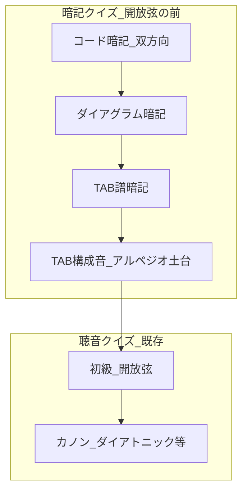

# ロードマップ：暗記3モード（開放弦の前段）

対象アプリ: `/Users/sen/Development/guitar-chord-quiz-line/`  
目的: 「初級：開放弦」の**前**に置く、見た目・名前の暗記クイズを3種追加する。

更新日: 2026-09-07（ユーザー回答を反映）

---

## 0. 確定した前提（ユーザー回答済み）

| 項目 | 確定内容 |
| :--- | :--- |
| ドレミ方式 | **固定ド**（C=ド … B=シ） |
| コード暗記の出題向き | **両方**（英字→ドレミ **と** ドレミ→英字） |
| コード暗記の対象 | 自然音 **C D E F G A B**（♯♭なし） |
| コード暗記と音声 | **音声なし**。ピアノロールも出さない |
| ダイアグラム / TAB の出題セット | 下記 **4系統**（すべて対象。段階出荷） |
| 選択肢の並び | 常に固定。シャッフルしない |
| 答え合わせ後 | **「次の問題」タップまで残す** |
| 左利き | ダイアグラムを**水平ミラー**。`localStorage` 永続 |
| 設置位置 | モード選択で **初級：開放弦より上** |

### ダイアグラム / TAB の4系統

| セット ID | 内容 | 答えるもの | 主メディア |
| :--- | :--- | :--- | :--- |
| `diatonic-c` | ダイアトニック7つ **C / Dm / Em / F / G / Am / Bm(♭5)** | コード名 | ダイアグラム or TAB（和音） |
| `canon-c` | カノン進行（C）**C / G / Am / Em / F** | コード名 | ダイアグラム or TAB（和音） |
| `open-strings` | 開放弦6音 **E / A / D / G / B / e** | 音名 | ダイアグラム（単音） or TAB（単音） |
| `diatonic-tones` | ダイアトニック7コードの**構成音を1音ずつ** | 音名（英字）またはドレミ※ | **TAB（単音）** ※アルペジオの土台 |

※`diatonic-tones` の選択肢は v1 では **英字音名（C〜B）固定**。コード暗記でドレミを別途鍛える。必要なら後でドレミ選択肢版を追加。

---

## 1. プロダクト概要



| 大モード | 問題の見せ方 | 答えるもの | 音声 |
| :--- | :--- | :--- | :--- |
| コード暗記 | 英字 **または** ドレミ（出題ごとに向きが変わる） | 反対側の表記 | なし |
| ダイアグラム暗記 | 指板図（和音 or 単音） | コード名 / 音名 | なし |
| TAB譜暗記 | TAB（和音 or 単音） | コード名 / 音名 | なし |

**モード選択UI（推奨）:**

1. 大分類: `暗記：コード` / `暗記：ダイアグラム` / `暗記：TAB`
2. セット（ダイアグラム・TAB時）: `ダイアトニック（C）` / `カノン（C）` / `開放弦` / `構成音（アルペジオ土台）` ※構成音は TAB のみでも可

モバイルでは `<select>` を2段にするか、1本の select に「暗記：TAB・構成音」のようにフラット列挙する。

共通UX:

- 正解 / ミス / 連続あり
- 選択後に正解ハイライト → 「次の問題 ▶」
- 練習モード（見るだけ）は別チケット

---

## 2. モード別仕様

### 2.1 暗記：コード（ドレミ）★双方向

**狙い:** 「E = ミ」「ミ = E」の両方を固定する。

**対応表:**

| 英字 | ドレミ |
| :--- | :--- |
| C | ド |
| D | レ |
| E | ミ |
| F | ファ |
| G | ソ |
| A | ラ |
| B | シ |

**出題ルール:**

- 各問で向きをランダムに選ぶ（または交互）。割合は **50% / 50%**
- **英字 → ドレミ:** 問題に大きく `E`、選択肢は常に **ド レ ミ ファ ソ ラ シ**
- **ドレミ → 英字:** 問題に大きく `ミ`、選択肢は常に **C D E F G A B**

**UI:**

- 再生・ピアノロール: 非表示
- ヒント例: 「対応する読み方を選んでください」
- 向きが分かるよう、問題の上に小さく「英字 → ドレミ」／「ドレミ → 英字」と表示してよい

**受け入れ条件:**

- [ ] 両方向とも出題される
- [ ] 各向きで選択肢の並びが常に固定
- [ ] E↔ミ、A↔ラ が相互に正解

---

### 2.2 暗記：ダイアグラム

**狙い:** 指板図を見て名前を当てる。

#### セット別データ

**A. ダイアトニック（C）— 7コード**

| コード | 6→1弦（X / 0 / フレット） |
| :--- | :--- |
| C | X-3-2-0-1-0 |
| Dm | X-X-0-2-3-1 |
| Em | 0-2-2-0-0-0 |
| F | 1-3-3-2-1-1 |
| G | 3-2-0-0-0-3 |
| Am | X-0-2-2-1-0 |
| Bm(♭5) | X-2-3-4-3-X |

選択肢（固定）: `C` `Dm` `Em` `F` `G` `Am` `Bm(♭5)`

**B. カノン進行（C）— 5コード**

C / G / Am / Em / F（押さえは上記と同じ定義を共有）

選択肢（固定）: `C` `G` `Am` `Em` `F`（カノンの並び順でも可。v1は **C G Am Em F**）

**C. 開放弦 — 6音**

単音ダイアグラム（該当弦のみ ●、他は X または薄く表示）。

| 表示 | 弦 | フレット |
| :--- | :--- | :--- |
| E | 6 | 0 |
| A | 5 | 0 |
| D | 4 | 0 |
| G | 3 | 0 |
| B | 2 | 0 |
| e | 1 | 0 |

選択肢（固定）: `E` `A` `D` `G` `B` `e`（チューニング順）

**描画・利き手:** データ駆動 SVG。右利きは左=ナット・上=1弦。左利きは水平ミラー。`gcq-handedness` で永続。

**受け入れ条件:**

- [ ] 3セットすべて出題可能
- [ ] 利き手トグルで即ミラー、リロード後も維持
- [ ] Bm(♭5) の4フレット窓が読める

---

### 2.3 暗記：TAB譜

**狙い:** TABを見て名前を当てる。ダイアグラムと**同一の押さえ／単音定義**から生成（二重管理しない）。

#### 和音 TAB（セット: diatonic-c / canon-c）

例（C）:

```text
e|--0--
B|--1--
G|--0--
D|--2--
A|--3--
E|--x--
```

選択肢はダイアグラムと同セット・同固定順。

#### 単音 TAB（セット: open-strings）

例（5弦開放 A）:

```text
e|-----
B|-----
G|-----
D|-----
A|--0--
E|-----
```

#### 構成音 TAB（セット: diatonic-tones）★アルペジオ土台

**狙い:** ダイアトニック三和音の構成音を、**実際の押さえ上の1音**として覚える。

**出題単位の例（C コード X32010 から）:**

| 構成音 | TAB上の位置（例） |
| :--- | :--- |
| C | 5弦3フレット |
| E | 4弦2フレット |
| G | 3弦開放 |
| C | 2弦1フレット |
| E | 1弦開放 |

7コード分、ミュート弦を除いた押さえてある音（＋開放で鳴らす音）をフラットな問題プールにする。  
同じ音名が複数ポジションあっても、**ポジション違いを別問題**にしてよい（アルペジオのため）。

**問題表示:** 単音 TAB（該当フレットだけ数字、他は `-`）  
**選択肢 v1:** 英字音名 `C D E F G A B` 固定（Bm♭5 の構成音 B D F もこの7文字で足りる）  
**任意ラベル:** 問題下に小さく「（Cコードの構成音）」と出してもよい（答えがコード名にならないよう注意。出すなら学習用ヒントとしてトグル）

**受け入れ条件:**

- [ ] 和音 TAB とダイアグラムが同じ shapes 由来
- [ ] 構成音セットで「1音 TAB → 音名」が解ける
- [ ] 開放弦セットの単音 TAB が解ける

---

## 3. 技術設計

### 3.1 データ層

```text
src/memorize/
  solfege.js      # C↔ド 双方向・選択肢定数
  shapes.js       # コード fret[] / 単音定義 / 構成音展開
  diagram.js      # SVG + 利き手
  tab.js          # 和音TAB・単音TAB生成
```

`shapes.js` が単一の正本。構成音プールは:

```js
expandChordTones(chordShape) → [{ pitchClass, string, fret, parentChordId }]
```

### 3.2 モードフラグ例

```js
{
  kind: "quiz-visual",
  promptType: "solfege-bidirectional" | "diagram" | "tab",
  setId: "diatonic-c" | "canon-c" | "open-strings" | "diatonic-tones",
  hidePlayer: true,
  hidePianoRoll: true,
}
```

### 3.3 共有フロー

既存の `awaitingNext` / スコアと同じ。visual モードでは再生ボタンを隠し、問題スロット（大文字 / SVG / TAB）を出す。

---

## 4. フェーズ分けロードマップ

### Phase 0 — 描画向きの目視合わせ（短）

- [ ] 右利きダイアグラムの弦上下を教材1枚と合わせる
- [ ] Bm(♭5) のフレット窓（〜4F）を確認

### Phase 1 — 暗記：コード（双方向）★最初に出荷

1. select に `暗記：コード` を開放弦より上へ
2. 出題向きをランダム（または交互）
3. 向きに応じて選択肢セット切替（ドレミ7 or 英字7、どちらも固定順）
4. 再生・ピアノロール非表示、大きな問題文字

完了: 両方向が解け、並びが崩れない。

### Phase 2 — shapes + 利き手

1. ダイアトニック7 + 開放弦6の定義
2. `expandChordTones` で構成音リスト生成
3. 利き手トグル + localStorage

### Phase 3 — ダイアグラム（ダイアトニック → カノン → 開放弦）

1. SVG 描画
2. セット切替 UI
3. 和音3セット＋開放弦単音

出荷順: **ダイアトニック7 → カノン5 → 開放弦6**

### Phase 4 — TAB（和音・開放弦）

1. shapes から TAB 生成
2. ダイアグラムと同セットを TAB でも提供

### Phase 5 — TAB 構成音（アルペジオ土台）

1. `diatonic-tones` プールで単音 TAB 出題
2. 選択肢は C〜B 固定
3. （任意）親コード名ヒントのオンオフ

### Phase 6 — 磨き・本番

- README / Obsidian 更新
- LIFF での可読性
- デプロイ

### Phase 7 — バックログ

- 構成音クイズの選択肢をドレミにする版
- ♯♭
- 暗記用練習モード（見るだけ）
- 正解時にその音/コードを短く再生
- 左利きの弦上下反転オプション

---

## 5. リスクと対策

| リスク | 対策 |
| :--- | :--- |
| モード数が増えて select が長い | 大分類＋セットの2段、または optgroup |
| 構成音ヒントでコード名がバレる | ヒントはオフ既定、または出さない |
| Bm(♭5) の表記ゆれ | UIは常に `Bm(♭5)` に統一 |
| F / Bm のフレット幅 | コードごとに表示フレット窓を可変 |
| `main.js` 肥大化 | Phase 2 で `memorize/` 分割 |

---

## 6. 実装チケット（要約）

| ID | 内容 | 依存 |
| :--- | :--- | :--- |
| M1 | 暗記：コード（双方向） | なし |
| M2 | shapes（7+開放弦）+ 構成音展開 + 利き手 | なし |
| M3 | ダイアグラム（ダイアトニック→カノン→開放弦） | M2 |
| M4 | TAB 和音・開放弦 | M2 |
| M5 | TAB 構成音（アルペジオ土台） | M2, M4 |
| M6 | ドキュメント・デプロイ | M1〜M5 |

推奨出荷順: **M1 → M2 → M3 → M4 → M5 → M6**

---

## 7. 現行ファイルへの主な変更予定

| ファイル | 変更 |
| :--- | :--- |
| [`index.html`](index.html) | モード / セット UI、問題枠、利き手トグル |
| [`src/main.js`](src/main.js) | 分岐の薄い層化 |
| [`src/style.css`](src/style.css) | ダイアグラム・TAB・大文字 |
| `src/memorize/*` | 新規 |
| [`README.md`](README.md) | モード表 |
| Obsidian `music/guitar-chord-quiz/` | 本ロードマップへのリンク |

---

## 8. 回答メモ（トレーサビリティ）

- コード暗記の向き: **C 両方やる** → Phase 1 で双方向実装（旧「逆向きは v2」は削除）
- ダイアグラム/TAB範囲: ダイアトニック7・カノンC・開放弦6・**構成音の単音TAB**をすべて対象とする
